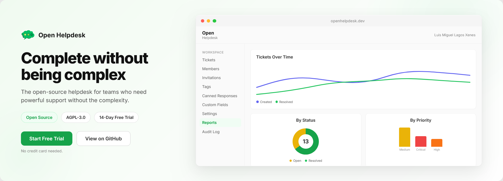

<div align="center">



[](https://www.gnu.org/licenses/agpl-3.0)

[Get Started](#get-started) · [Features](#features) · [Self-Hosting](#self-hosting) · [Contributing](#contributing)

</div>

---

## What is Open Helpdesk?

Open Helpdesk is a full-featured, multi-tenant helpdesk system built for teams that want powerful support tools without the complexity of enterprise solutions.

**Why Open Helpdesk?**
- **Simple** — clean, modern interface anyone understands in minutes
- **Open** — self-host with full control, or use our managed cloud
- **Complete** — all the features your team needs, ready out of the box
- **Affordable** — generous free tier, transparent pricing, no per-agent surprises

## Features

- **Ticket Management** — Full lifecycle: create, assign, track, resolve, discard. Priority, categories, custom fields
- **Reports & CSAT** — Resolution metrics, agent performance, charts, and customer satisfaction surveys
- **Canned Responses** — Predefined replies with "/" quick inserter for faster agent responses
- **Custom Fields** — 6 field types (text, number, select, multi-select, date, checkbox) per workspace
- **Audit Log** — Track every action across your workspace with detailed metadata
- **Roles & Permissions** — 20+ granular permissions across 3 roles (Admin, Agent, Reporter)
- **Workspaces** — Multi-tenant isolation with custom color palettes and branding
- **Invitations** — Invite team members by email with batch support and auto-accept on signup
- **Comments & Mentions** — Mention teammates with autocomplete. XSS-sanitized content
- **Email-to-Ticket** — Customers send an email, a ticket is created. Replies become comments. Works with any IMAP mailbox
- **Email Notifications** — Configurable per-event with SMTP support
- **In-App Notifications** — Real-time polling, mark as read, per-event preferences
- **File Attachments** — S3-compatible storage, drag & drop, clipboard paste, image lightbox
- **Tags** — Color-coded tags per workspace for flexible organization
- **Dark Mode** — 5 theme options: System, Light, Light Border, Dark, Dark Deep
- **i18n** — Full English and Spanish translations, including email templates

## Tech Stack

| Layer | Technology |
|-------|-----------|
| Backend | NestJS, TypeORM, PostgreSQL |
| Frontend | React 19, Vite, Tailwind CSS 4 |
| Storage | S3-compatible (AWS, MinIO, Hetzner) |
| Email | SMTP / Postmark |
| Auth | JWT with refresh tokens |
| Deploy | Docker, Coolify |

## Repositories

| Repository | Description |
|-----------|-------------|
| [open-helpdesk-backend](https://github.com/Hyzokaaa/open-helpdesk-backend) | NestJS API — clean architecture, domain services, unit tests |
| [open-helpdesk-client](https://github.com/Hyzokaaa/open-helpdesk-client) | React SPA — custom UI components, i18n, dark mode |

## Get Started

### Option 1: Managed Cloud

Sign up at [openhelpdesk.dev](https://openhelpdesk.dev) and get a free workspace in 30 seconds. No credit card required.

### Option 2: Self-Hosting

```bash
git clone https://github.com/Hyzokaaa/open-helpdesk.git
cd open-helpdesk
cp .env.example .env
docker compose up -d
```

That's it. Open [localhost](http://localhost) for the app, API runs on port 3000.

Default admin: `admin@admin.com` / `admin1234` — change these in `.env` before going to production.

### Configuration

All settings are in `.env`. The defaults work out of the box for local use. For production, you should change:

| Variable | Description |
|----------|-------------|
| `JWT_SECRET` | Secret key for authentication tokens |
| `ADMIN_EMAIL` / `ADMIN_PASSWORD` | Initial admin credentials |
| `DB_PASSWORD` | Database password |
| `SMTP_*` | Email server for notifications |
| `FRONTEND_URL` | Public URL of your deployment |
| `VITE_API_URL` | Backend URL the client connects to |
| `VITE_APP_NAME` | App name shown in the UI (default: `Open`) |
| `VITE_APP_SUBTITLE` | Subtitle shown below the name (default: `Helpdesk`) |
| `EMAIL_DOMAIN` | Your domain for email threading headers (optional) |
| `SUPPORT_EMAIL_DOMAIN` | Domain for workspace support addresses (optional) |
| `IMAP_HOST` / `IMAP_USER` / `IMAP_PASS` | IMAP mailbox for email-to-ticket (optional) |

See [`.env.example`](.env.example) for all available options.

### Email-to-Ticket (optional)

Let your customers create tickets by sending an email. You have two options:

#### Option A: IMAP (recommended — works with any email provider)

1. Create a dedicated email account (e.g. `support@yourcompany.com`) with any provider (Gmail, Outlook, your own mail server)
2. Add the IMAP credentials to your `.env`:

```env
IMAP_HOST=imap.gmail.com
IMAP_PORT=993
IMAP_USER=support@yourcompany.com
IMAP_PASS=your-app-password
EMAIL_DOMAIN=yourcompany.com
```

3. Restart the backend. It will poll the mailbox every 30 seconds for new emails.
4. Go to **Workspace Settings → Email Mailboxes → Connect Mailbox** and add the same email address as a mailbox linked to your workspace.
5. Send a test email to that address — a ticket should appear in your dashboard.

> **Gmail users:** You need an [App Password](https://myaccount.google.com/apppasswords), not your regular password. Enable 2-Step Verification first.

> **Multiple mailboxes:** You can also skip the env vars entirely and configure everything from the UI. Each workspace can have its own IMAP mailbox.

#### Option B: MTA Hook (for Stalwart or compatible mail servers)

If you run your own mail server with MTA Hook support (like [Stalwart](https://stalw.art)):

```env
SUPPORT_EMAIL_DOMAIN=support.yourcompany.com
EMAIL_DOMAIN=yourcompany.com
MTA_HOOK_USER=mta-hook
MTA_HOOK_SECRET=your-secret
```

Configure your mail server to POST incoming emails to `https://your-api-url/inbound/email` with Basic Auth.

### HTTPS / Reverse Proxy

If you're running behind a reverse proxy (nginx, Caddy, etc.) with HTTPS, you need to proxy both the client and the backend API. Example nginx config:

```nginx
server {
    listen 443 ssl;
    server_name helpdesk.example.com;

    ssl_certificate     /path/to/cert.pem;
    ssl_certificate_key /path/to/key.pem;

    # Frontend
    location / {
        proxy_pass http://localhost:80;
        proxy_set_header Host $host;
        proxy_set_header X-Real-IP $remote_addr;
        proxy_set_header X-Forwarded-For $proxy_add_x_forwarded_for;
        proxy_set_header X-Forwarded-Proto $scheme;
    }

    # Backend API
    location /api/ {
        proxy_pass http://localhost:3000/;
        proxy_set_header Host $host;
        proxy_set_header X-Real-IP $remote_addr;
        proxy_set_header X-Forwarded-For $proxy_add_x_forwarded_for;
        proxy_set_header X-Forwarded-Proto $scheme;
    }
}
```

Then set your `.env` accordingly:

```env
FRONTEND_URL=https://helpdesk.example.com
VITE_API_URL=https://helpdesk.example.com/api
```

> **Note:** The trailing slash in `proxy_pass http://localhost:3000/` is important — it strips the `/api/` prefix so the backend receives the correct paths.

### Embed in Your Product (Token Exchange)

You can integrate Open Helpdesk into your own application so your users access the helpdesk without a separate login. This works by exchanging a user's identity from your system for an Open Helpdesk JWT.

#### 1. Create an API key

Go to **Workspace Settings → API Keys** and create a key with the **Token exchange (SSO)** scope (`auth:exchange`).

#### 2. Add one endpoint to your backend

When your user needs to access the helpdesk, your backend calls Open Helpdesk to get a JWT:

```javascript
// Your backend (Express, NestJS, Django, Rails, etc.)
app.get('/api/helpdesk-token', auth, async (req, res) => {
  const response = await fetch('https://your-helpdesk-api/api/v1/auth/exchange', {
    method: 'POST',
    headers: {
      'Authorization': 'Bearer ohd_your_api_key',
      'Content-Type': 'application/json',
    },
    body: JSON.stringify({
      email: req.user.email,
      firstName: req.user.firstName,
      lastName: req.user.lastName,
      role: 'agent', // agent, admin, supervisor, or reporter
    }),
  });
  const { accessToken } = await response.json();
  res.json({ token: accessToken });
});
```

#### 3. Use the token in the frontend

```javascript
// Your frontend
const { token } = await fetch('/api/helpdesk-token').then(r => r.json());
localStorage.setItem('access_token', token);
window.location.href = '/helpdesk'; // Your Open Helpdesk client deployment
```

**What happens:**
- If the user doesn't exist in Open Helpdesk, they are automatically created and added to the workspace
- If they already exist, a new JWT is issued
- The user never sees an Open Helpdesk login screen

**Request:**
```
POST /api/v1/auth/exchange
Authorization: Bearer ohd_your_api_key
Content-Type: application/json

{
  "email": "user@company.com",
  "firstName": "Jane",
  "lastName": "Doe",
  "role": "agent"       // optional, defaults to "agent"
}
```

**Response:**
```json
{
  "accessToken": "eyJhbG...",
  "user": { "id": "01J...", "email": "user@company.com" }
}
```

## Architecture

The backend follows clean architecture with strict layer separation:

```
src/
  <module>/
    domain/          # Entities, repositories (interfaces), services (business logic)
    application/     # Commands and queries (use case orchestration)
    infrastructure/  # Controllers, TypeORM models, repository implementations
```

- **Domain services** contain all business logic — no framework dependencies
- **Commands/Queries** orchestrate use cases — no entity mutation, no framework imports
- **Controllers** are pure wiring — inject dependencies, instantiate commands, return results

## Contributing

Contributions are welcome! Open Helpdesk is licensed under [AGPL-3.0](LICENSE), which means:

- You can use, modify, and self-host freely
- If you offer a modified version as a service, you must publish your changes
- The copyright holder can grant commercial exceptions

To contribute:

1. Fork the relevant repository (backend or client)
2. Create a feature branch
3. Follow the architecture conventions described above
4. Submit a pull request

## License

[AGPL-3.0](LICENSE) © 2026 Luis Miguel (Hyzokaaa)
